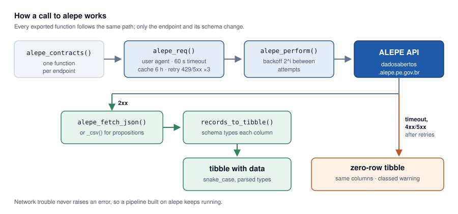

# alepe 

[](https://pypi.org/project/alepe/)
[](https://pypi.org/project/alepe/)
[](https://github.com/StrategicProjects/alepe_py/actions/workflows/tests.yml)
[](https://github.com/StrategicProjects/alepe_py/blob/main/LICENSE)

Tidy access from Python to the open data API of the Legislative Assembly of the
State of Pernambuco, Brazil ([ALEPE](https://dadosabertos.alepe.pe.gov.br)):
representatives, staff, positions, departments, remuneration, contracts,
procurement and legislative propositions — as pandas frames with clean names
and parsed types.

This is the Python sibling of the R package
[alepe](https://strategicprojects.github.io/alepe/); both wrap the same
endpoints and produce the same column names.

## Installation

```bash
pip install alepe
```

## Quick start

```python
import alepe

# Current representatives
alepe.representatives()

# Permanent staff, largest departments
alepe.staff(status="permanent").value_counts("nome_lotacao")

# Contracts active today
import datetime as dt
today = dt.date.today()
contracts = alepe.contracts()
contracts[(contracts.vigencia_inicio <= today) & (contracts.vigencia_fim >= today)]

# Bills of a given year
alepe.bills(year=2024)
```

Column names keep the official Portuguese field names, normalised to
snake_case, so a result stays traceable to its source. Filter *values* accept
both vocabularies — `status="permanent"` and `status="efetivo"` are the same
query.

## Em português

Cada função tem um alias com o nome do próprio endpoint da API, para quem
prefere manter o pipeline inteiro em português:

```python
alepe.parlamentares()
alepe.servidores(status="efetivo")
alepe.contratos()
alepe.projetos(ano=2024)
```

`cargos()`, `lotacoes()`, `remuneracao()`, `licitacoes()`, `indicacoes()`,
`requerimentos()` e `limpar_cache()` completam o conjunto.

## How it works

Every function is a thin wrapper over the same core: a cached, retrying request
whose response is typed into a frame by a documented schema.



## What the package handles for you

The API is generated from an internal system and shows it. Three quirks would
otherwise produce quietly wrong numbers:

- **Two naming conventions at once.** `NOME_LOTACAO` from `/servidores`,
  `nomeParlamentar` from `/parlamentares`. Both become `nome_lotacao` and
  `nome_parlamentar`.
- **Two number encodings at once.** `"1.234,56"` in some fields and
  float-formatted strings such as `"119267.04"` in others. Reading either with
  a fixed locale corrupts the other — a Brazilian locale turns `119267.04` into
  11 926 704. The parser decides per value.
- **Dates in three shapes**, including serialised `DateTime` objects
  (`{"date": "2026-05-05 00:00:00.000000", ...}`).

The propositions endpoints answer XML embedded in CSV; the package parses it
into ordinary columns and strips the HTML markup out of the free-text fields.

## Caching, retries and failures

Responses are cached for six hours in the session's temporary directory. Set
`ALEPE_CACHE_DIR`, or call `alepe.cache_dir(path)`, to keep them between
sessions; `alepe.cache_clear()` empties it, and any call takes `refresh=True`
to bypass it.

Requests are retried up to three times on 429 and 5xx with exponential backoff,
with a 60-second timeout. That default is measured, not habitual:
`/licitacoes` regularly takes 25–30 seconds to answer, and the service cuts its
own query off at 30 seconds, so a 30-second client timeout fails on margin
alone.

When the API cannot be reached, the call raises `AlepeHTTPError`, carrying the
status code and the URL. This is where the two siblings differ on purpose:
CRAN's policy on internet resources requires the R package to warn and return
an empty result instead of stopping, while a silent empty frame would be
surprising in Python.

```python
try:
    frame = alepe.procurements()
except alepe.AlepeHTTPError as err:
    print(f"ALEPE is not answering ({err.status}); carrying on without it")
    frame = alepe.empty("procurements")
```

`alepe.empty(name)` returns a correctly typed empty frame for any endpoint,
which is what you want when a pipeline downstream expects the columns to exist
either way.

## Related packages

Part of a family of clients for Brazilian public data published under
[StrategicProjects](https://github.com/StrategicProjects), with siblings in R
on CRAN: [tceper](https://CRAN.R-project.org/package=tceper) (Pernambuco Court
of Accounts), [transferegovr](https://CRAN.R-project.org/package=transferegovr)
and its Python twin
[transferegovpy](https://pypi.org/project/transferegovpy/),
[tesouror](https://CRAN.R-project.org/package=tesouror),
[comexr](https://CRAN.R-project.org/package=comexr),
[datasusr](https://CRAN.R-project.org/package=datasusr),
[ibger](https://CRAN.R-project.org/package=ibger) and
[pixr](https://CRAN.R-project.org/package=pixr).

## License

MIT.
